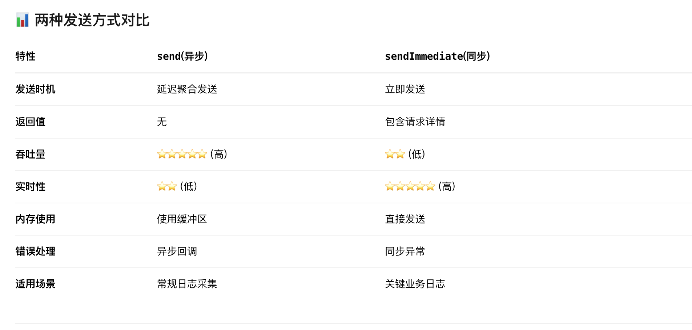

## CLS JavaScript SDK

腾讯云CLS日志上传SDK, 支持nodejs

## 安装指令
```
npm i tencentcloud-cls-sdk-nodejs
```

## 参数描述
# ProducerOptions Interface

| Property | Type | Description | Optional |
|----------|------|-------------|----------|
| `topic_id` | `string` | The cls service topic id (e.g. "xxxx-xxxx-xxxx-xxxx") | No |
| `endpoint` | `string` | The cls service topic region endpoint URL (e.g. "ap-guangzhou.cls.tencentcs.com") | No |
| `credential` | `Credential` | Authentication information | No |
| `sourceIp` | `string` | client ip | Yes |
| `sendTimeout` | `number` | Request timeout in seconds, default 60s | Yes |
| `time` | `number` | 发送时间阈值, default 2s | Yes |
| `count` | `number` | 发送条数阈值, default 1000 | Yes |
| `onSendLogsError` | `function` | 上传回调 | Yes |
| `maxMemLogCount` | `number` | 最大内存存储的数据长度, default 10000 | Yes |

# Credential Interface

| Property | Type | Description | Optional |
|----------|------|-------------|----------|
| `secretId` | `string` | Tencent Cloud account secretId and secretKey | No |
| `secretKey` | `string` | Tencent Cloud account secretKey | No |
| `token` | `string` | Tencent Cloud account token (mutually exclusive with secretId) | Yes |

### 注意： 

endpoint填写请参考[可用地域](https://cloud.tencent.com/document/product/614/18940#.E5.9F.9F.E5.90.8D)中 **API上传日志** Tab中的域名

本文档详细说明 CLS Producer 的两种日志发送接口：异步发送 send和同步发送 sendImmediate。

## 异步发送接口 send

```typescript
public async send(log: LogItem): Promise<void>
```

### 使用方式
```typescript
let client = new Producer({
    endpoint: "ap-xian-ec.cls.tencentyun.com",
    topic_id: "dbb3d9f9-47fc-46f5-a0ee-",
    credential: {
        secretId: "**",
        secretKey: "**",
        token: ""
    },
});
let item = new LogItem()
item.pushBack(new Content("__CONTENT__", "你好，我来自深圳|hello world"))
item.setTime(Math.floor(Date.now() / 1000))
try {
    let message = await client.send(item);
} catch (error) {
    if (error instanceof TencentCloudClsSDKException) {
        console.log(error.toString())
    } else {
        console.log(error)
    }
}        
```

## 同步发送接口

```typescript
public async sendImmediate(logs: LogItem[]): Promise<ClsMessage>
```

### 使用文档

```typescript
let client = new Producer({
    endpoint: "ap-xian-ec.cls.tencentyun.com",
    topic_id: "dbb3d9f9-47fc-46f5-a0ee-",
    credential: {
        secretId: "**",
        secretKey: "**",
        token: ""
    },
});
let items: LogItem[] = []
let item = new LogItem()
item.pushBack(new Content("__CONTENT__", "你好，我来自深圳|hello world"))
item.setTime(Math.floor(Date.now() / 1000))
items.push(item)
try {
    let message = await client.sendImmediate(items);
    console.log(message)
} catch (error) {
    if (error instanceof TencentCloudClsSDKException) {
        console.log(error.toString())
    }
}
```

## 使用选择




